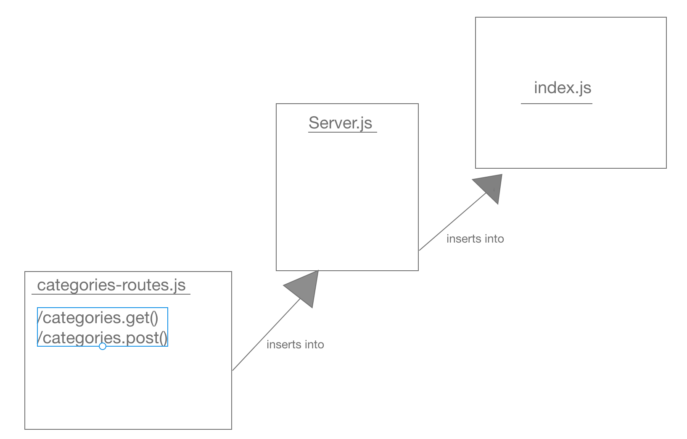

# LAB - 07

## API - Server

### Author: Adrian Huebner

### Links and Resources
* [submission PR](https://github.com/Adrian-Huebner-401-advanced-javascript/lab-07-api-server/pull/1)
* [travis](https://travis-ci.com/Adrian-Huebner-401-advanced-javascript/lab-07-api-server)
* [front-end](https://simple-api-adrianhuebner.herokuapp.com/)

### Setup
#### `.env` requirements
* `PORT` - Port Number

#### Running the app
* `node index.js`
  

#### UML

